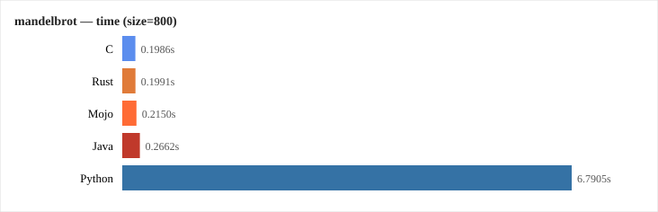
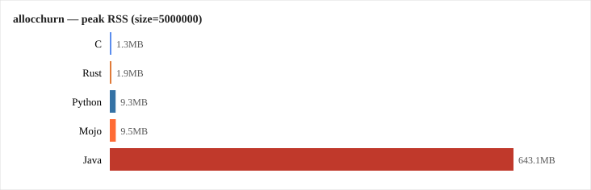
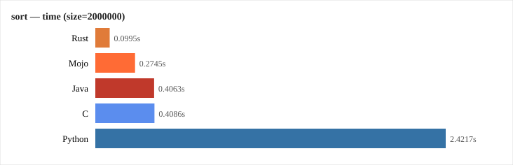

# mojo-benchmark-suite

Cross-language benchmark suite comparing **Mojo**, **C**, **Rust**, **Java**,
and **Python** on fourteen workloads — from tight numeric loops to hash maps,
threading, trees/graphs, hand-rolled SIMD/JSON parsing, and a native GPU
kernel. One CLI runner builds, times, and self-checks every language's
implementation of every benchmark, and reports wall-clock time *and* peak
memory.

This is a personal project for exploring where Mojo actually wins, where it
doesn't (yet), and how it compares to the languages people already reach for.

## Results at a glance




Full numbers for every benchmark: [`docs/results/reference-run.json`](docs/results/reference-run.json).
Regenerate these charts yourself with `python3 runner/run.py --benchmark all --json`
then `python3 runner/report.py results/<file>.json --export-dir docs/results`.

## Benchmarks

| Benchmark | What it exercises | Languages | Default size |
|---|---|---|---|
| `fib` | recursive function-call overhead | C, Rust, Java, Python, Mojo | `n=32` |
| `sort` | builtin sort of random ints | C, Rust, Java, Python, Mojo | 2,000,000 elements |
| `matmul` | naive O(n³) triple-loop matrix multiply | C, Rust, Java, Python, Mojo | 400×400 |
| `mandelbrot` | scalar per-pixel escape-time fractal | C, Rust, Java, Python, Mojo | 800×800 grid |
| `mandelbrot_simd` | the same fractal, explicitly vectorized (AVX2 intrinsics in C/Rust, native `SIMD` in Mojo, incubator Vector API in Java, numpy in Python) | C, Rust, Java, Python, Mojo | 800×800 grid |
| `nbody` | O(n²) pairwise gravity simulation, momentum-conserving | C, Rust, Java, Python, Mojo | 300 bodies |
| `wordcount` | hash map insert/increment over a small vocabulary | C, Rust, Java, Python, Mojo | 2,000,000 tokens |
| `primes_parallel` | 4-way multi-threaded/multi-process prime counting | C, Rust, Java, Python | up to N=2,000,000 |
| `ipvalidate` | hand-rolled string parsing (no regex anywhere) | C, Rust, Java, Python, Mojo | 2,000,000 strings |
| `allocchurn` | many small alloc/use/free cycles — allocator and GC pressure | C, Rust, Java, Python, Mojo | 5,000,000 iterations |
| `graph_bfs` | BFS traversal of a fixed-width adjacency list (guaranteed connected) | C, Rust, Java, Python, Mojo | 500,000 nodes |
| `bst` | binary search tree build + in-order traversal | C, Rust, Java, Python, Mojo | 300,000 keys |
| `json_roundtrip` | hand-rolled JSON encode then decode for a fixed schema (no library anywhere) | C, Rust, Java, Python, Mojo | 200,000 records |
| `mandelbrot_gpu` | the same fractal again, one GPU thread per pixel (Mojo `max.gpu.host.DeviceContext`, Python `cupy.RawKernel`) | Python, Mojo | 4096×4096 grid |

`primes_parallel` has no Mojo entry (current stable Mojo has no OS-thread
API — see [Design notes](#design-notes)). `mandelbrot_gpu` has no C/Rust/Java
entry (see below). Every other benchmark covers all 5 languages. The runner
handles missing per-language sources gracefully, so it's easy to add more
languages to a benchmark later, or vice versa.

## Requirements

| Language | Install |
|---|---|
| C | `gcc` (preinstalled on most Linux distros) |
| Rust | [rustup](https://rustup.rs): `curl --proto '=https' --tlsv1.2 -sSf https://sh.rustup.rs \| sh` |
| Java | JDK 17+ (`javac`/`java` on `PATH`) — the Vector API used by `mandelbrot_simd` is an incubator module available since JDK 16 |
| Python | `python3` (3.9+), plus `sudo apt install python3-numpy` (for `mandelbrot_simd`) and `pip install --user cupy-cuda12x[ctk]` (for `mandelbrot_gpu`, NVIDIA GPU only) |
| Mojo | [pixi](https://pixi.prefix.dev): `curl -fsSL https://pixi.sh/install.sh \| sh`, then `pixi install` (this repo's `pixi.toml` already depends on `mojo` and `max`, the latter needed for `mandelbrot_gpu`'s GPU host API) |

You don't need all five to use the suite — the runner builds whatever
languages have source files for a given benchmark and reports the rest as
skipped. `mandelbrot_gpu` additionally needs an NVIDIA GPU with driver 580+
(check with `nvidia-smi`) — no CUDA toolkit/`nvcc` required for either
Mojo or the CuPy path.

## Quick start

```sh
git clone https://github.com/John2206/mojo-benchmark-suite.git
cd mojo-benchmark-suite
pixi install                       # sets up the Mojo toolchain (skip if you don't have pixi)

python3 runner/run.py --benchmark fib --size 30 --repeats 3
```

```
=== fib (size=30) ===
  Language      min (s)   median (s)  peak RSS (MB)
  C              0.0063       0.0068            1.5
  Rust           0.0080       0.0084            1.8
  Mojo           0.0287       0.0301            9.2
  Java           0.1163       0.1201           42.0
  Python         0.1370       0.1390            9.3
```

## Usage

```sh
python3 runner/run.py                          # run every benchmark, default sizes
python3 runner/run.py --benchmark sort         # just one benchmark
python3 runner/run.py --benchmark sort --size 5000000
python3 runner/run.py --repeats 10 --json      # more samples per language, dump results/<timestamp>.json
```

| Flag | Meaning |
|---|---|
| `--benchmark {name\|all}` | which benchmark to run (default: `all`) |
| `--size N` | override the default problem size (only valid with a single `--benchmark` — sizes aren't comparable across benchmarks) |
| `--repeats N` | how many times to run each language (default 5); the table reports min and median |
| `--json` | write the full results, including every individual run, to `results/<UTC timestamp>.json` |

Sample real output (`sort`, `mandelbrot` — see [Results at a glance](#results-at-a-glance)
and `docs/results/reference-run.json` for the full 14-benchmark picture):

```
=== sort (size=2000000) ===
  Language      min (s)  peak RSS (MB)
  Rust           0.0976           24.7
  Mojo           0.2792           16.8
  Java           0.3913           53.9
  C              0.4162           16.3
  Python         2.3447           97.6

=== mandelbrot (size=800) ===
  Language      min (s)  peak RSS (MB)
  Rust           0.4064            2.0
  C              0.4075            1.5
  Mojo           0.4220            9.2
  Java           0.5282           42.8
  Python        13.3071            9.2
```

### Every benchmark verifies its own output

Each program checks a deterministic property of its own result (`sort`
verifies the array is actually sorted, `matmul` spot-checks one cell,
`nbody` checks momentum conservation, etc.) and exits non-zero with a
message on `stderr` if it's wrong. The runner treats that as a failure for
that language rather than reporting a bogus time — a broken implementation
can't silently win by being fast.

### Reporting tools

```sh
python3 runner/history.py                     # time + memory trend across every past --json run
python3 runner/history.py --benchmark sort     # just one benchmark
python3 runner/report.py                       # static HTML bar-chart report from the latest run
python3 runner/report.py results/foo.json -o out.html
```

`history.py` groups by (benchmark, language) and shows a `%` change between
consecutive runs *of the same size* (different sizes aren't compared).
`report.py` renders one time chart and one peak-memory chart per benchmark
as plain hand-rolled SVG — no charting library, no new dependency.

## Project layout

```
benchmarks/
  <name>/
    c/<name>.c            rust/<name>.rs
    java/<Name>.java       python/<name>.py
    mojo/<name>.mojo
runner/
  languages.py       per-language build/run commands + the benchmark registry
  run.py             builds, times, self-checks, prints the table, writes JSON
  history.py         trend view across results/*.json
  report.py          static HTML chart view
results/             --json output (gitignored)
bin/                 compiled binaries/classes (gitignored)
```

Adding a benchmark means: one new folder under `benchmarks/`, one source
file per language following the existing self-check pattern, and one new
entry in the `BENCHMARKS` dict in `runner/languages.py`. No other code
changes needed — that dict-driven design is why `primes_parallel` can skip
Mojo and `mandelbrot_simd`'s Python entry can look structurally different
(whole-grid numpy vectorization vs. everyone else's hand-chunked 4-lane
loop) without the runner caring.

## Design notes

- **Timing is process-level**, not an in-language timer: `subprocess` +
  `time.perf_counter()` around the whole run. This is simpler and fair
  across compiled and interpreted languages, and it captures real startup
  cost (JVM warm-up, Python interpreter init) — but it does *not* isolate
  steady-state/JIT-warmed performance. Treat these numbers as "run this
  program end to end," not a microarchitectural comparison.
- **Peak memory** comes from `/usr/bin/time -v`'s "Maximum resident set
  size," captured alongside every timed run.
- **`primes_parallel` has no Mojo entry** because current stable Mojo has no
  OS-thread API — only an experimental async `TaskGroup` that isn't
  considered ready for use yet. Rather than force it, the benchmark just
  shows C `pthread`, Rust `std::thread`, Java `Thread`, and Python
  `multiprocessing` (deliberately not `threading` — CPU-bound Python threads
  are GIL-bound, so `multiprocessing` is the real stdlib answer).
- **`ipvalidate` avoids regex everywhere**, including in languages that have
  it, so the comparison is about raw string/char handling, not regex engine
  quality (and because Mojo has no stdlib regex module at all).
- **`mandelbrot_simd`'s SIMD is scoped per-function**, not via a global
  compiler flag: C uses `__attribute__((target("avx2")))`, Rust uses
  `#[target_feature(enable = "avx2")]` — both mean the rest of each
  language's benchmarks keep compiling for a generic target.
- **`json_roundtrip` uses a fixed schema with no RNG anywhere**, so unlike
  every other benchmark, all 5 languages print the exact same output number
  for a given size — a bonus cross-language sanity check on top of each
  language's own self-check.
- **`mandelbrot_gpu` only covers Mojo and Python.** Both need just the
  NVIDIA driver — Mojo's GPU support compiles its own kernels (no `nvcc`),
  and `cupy.RawKernel` JIT-compiles CUDA C via NVRTC using pip-installed
  headers, not a system toolkit. C, Rust, and Java would need actual
  `nvcc`-compiled kernels, which means Ubuntu's `nvidia-cuda-toolkit` apt
  package — 73 packages, GUI profilers (nsight-compute/systems), and an
  unrelated OpenJDK 8 JRE along for the ride. Skipped for now. Since the GPU
  version runs a much bigger grid (4096×4096 vs. `mandelbrot_simd`'s
  800×800), compare them by throughput, not raw time: Mojo's GPU kernel
  processes ~4.8x more pixels/second than Mojo's own CPU SIMD version, and
  CuPy hits ~175x numpy's CPU throughput.

## License

[MIT](LICENSE)
