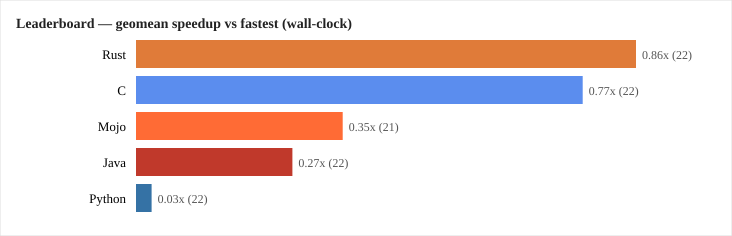
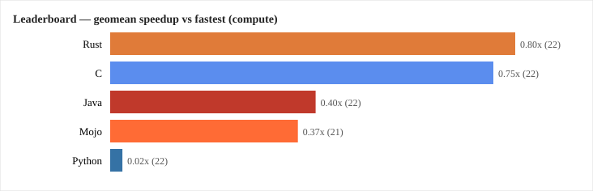
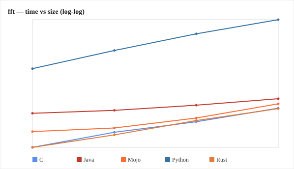

# mojo-benchmark-suite

Cross-language benchmark suite comparing **Mojo**, **C**, **Rust**, **Java**,
and **Python** on twenty-six workloads — from tight numeric loops to hash maps,
threading, trees/graphs, hand-rolled SIMD/JSON parsing, and a native GPU
kernel. One CLI runner builds, times, self-checks, and **cross-verifies**
every language's implementation of every benchmark, reporting wall-clock
time, startup-adjusted compute time, and peak memory — plus a scaling sweep
that shows how each language's standing changes as the problem grows.

This is a personal project for exploring where Mojo actually wins, where it
doesn't (yet), and how it compares to the languages people already reach for.

## Results at a glance




Two leaderboards, both ranking each language by geometric-mean speedup versus
the fastest language on each benchmark it implements. The left one uses
wall-clock time; the right subtracts each language's own process-startup cost
first (see
[Wall-clock vs compute](#wall-clock-vs-compute-separating-startup-cost)).
The number in parentheses is how many benchmarks that language was scored on
— not every language implements every benchmark (see `primes_parallel`
below), and the 4 benchmarks that can't be cross-verified are excluded from
both (see
[Verification](#verification-two-independent-layers)).

Full numbers for every benchmark: [`docs/results/reference-run.json`](docs/results/reference-run.json).
Regenerate these charts yourself with `python3 runner/run.py --benchmark all --json`
then `python3 runner/report.py results/<file>.json --export-dir docs/results`.

## Benchmarks

| Benchmark | What it exercises | Languages | Default size |
|---|---|---|---|
| `fib` | recursive function-call overhead | C, Rust, Java, Python, Mojo | `n=32` |
| `sort` | builtin sort of random ints | C, Rust, Java, Python, Mojo | 2,000,000 elements |
| `matmul` | naive O(n³) triple-loop matrix multiply | C, Rust, Java, Python, Mojo | 400×400 |
| `mandelbrot` | scalar per-pixel escape-time fractal | C, Rust, Java, Python, Mojo | 800×800 grid |
| `mandelbrot_simd` | the same fractal, explicitly vectorized (AVX2 intrinsics in C/Rust, native `SIMD` in Mojo, incubator Vector API in Java, numpy in Python) | C, Rust, Java, Python, Mojo | 800×800 grid |
| `nbody` | O(n²) pairwise gravity simulation, momentum-conserving | C, Rust, Java, Python, Mojo | 300 bodies |
| `wordcount` | hash map insert/increment over a small vocabulary | C, Rust, Java, Python, Mojo | 2,000,000 tokens |
| `primes_parallel` | 4-way multi-threaded/multi-process prime counting | C, Rust, Java, Python | up to N=2,000,000 |
| `ipvalidate` | hand-rolled string parsing (no regex anywhere) | C, Rust, Java, Python, Mojo | 2,000,000 strings |
| `allocchurn` | many small alloc/use/free cycles — allocator and GC pressure | C, Rust, Java, Python, Mojo | 5,000,000 iterations |
| `graph_bfs` | BFS traversal of a fixed-width adjacency list (guaranteed connected) | C, Rust, Java, Python, Mojo | 500,000 nodes |
| `bst` | binary search tree build + in-order traversal | C, Rust, Java, Python, Mojo | 300,000 keys |
| `json_roundtrip` | hand-rolled JSON encode then decode for a fixed schema (no library anywhere) | C, Rust, Java, Python, Mojo | 200,000 records |
| `mandelbrot_gpu` | the same fractal again, one GPU thread per pixel (CUDA C/JNI shim in C and Java, raw CUDA Driver API FFI in Rust, `max.gpu.host.DeviceContext` in Mojo, `cupy.RawKernel` in Python) | C, Rust, Java, Python, Mojo | 4096×4096 grid |
| `matmul_gpu` | the same naive matmul again, one GPU thread per output cell | C, Rust, Java, Python, Mojo | 2048×2048 |
| `matmul_gpu_warm` | same naive matmul kernel (fixed 256×256), but one warm process launches it N times back to back instead of once | C, Rust, Java, Python, Mojo | `N=500` iterations |
| `crc32` | table-driven CRC-32 (IEEE 802.3/zlib polynomial), hand-rolled, no library | C, Rust, Java, Python, Mojo | 50,000,000 bytes |
| `base64` | RFC 4648 encode then decode roundtrip, hand-rolled, no library | C, Rust, Java, Python, Mojo | 20,000,000 bytes |
| `sha256` | hand-rolled FIPS 180-4 SHA-256, no crypto library anywhere | C, Rust, Java, Python, Mojo | 2,000,000 bytes |
| `levenshtein` | rolling 2-row edit-distance DP between two similar sequences | C, Rust, Java, Python, Mojo | 5,000-length strings |
| `lru_cache` | hashmap + hand-rolled doubly-linked-list LRU eviction | C, Rust, Java, Python, Mojo | 2,000,000 operations |
| `dijkstra` | weighted `graph_bfs`-style graph, binary-heap shortest path | C, Rust, Java, Python, Mojo | 300,000 nodes |
| `matmul_blocked` | cache-blocked/tiled matmul — the real technique BLAS libraries use | C, Rust, Java, Python, Mojo | 600×600 |
| `lz77` | hash-based LZ77 compress/decompress roundtrip, hand-rolled | C, Rust, Java, Python, Mojo | 5,000,000 bytes |
| `montecarlo` | LCG-based Monte Carlo π estimation | C, Rust, Java, Python, Mojo | 50,000,000 samples |
| `fft` | iterative radix-2 Cooley-Tukey FFT, forward + inverse roundtrip | C, Rust, Java, Python, Mojo | 1,048,576 samples |

`primes_parallel` has no Mojo entry (current stable Mojo has no OS-thread
API — see [Design notes](#design-notes)). Every other benchmark, including
both GPU ones, covers all 5 languages. The runner handles missing
per-language sources gracefully, so it's easy to add more languages to a
benchmark later, or vice versa.

## Requirements

| Language | Install |
|---|---|
| C | `gcc` (preinstalled on most Linux distros); the 3 GPU benchmarks are actual `.cu` files built with `nvcc` instead — see the CUDA toolkit note below |
| Rust | [rustup](https://rustup.rs): `curl --proto '=https' --tlsv1.2 -sSf https://sh.rustup.rs \| sh`; the 3 GPU benchmarks also need `nvcc` (to compile the kernel to PTX) and link against `libcuda.so` directly — no extra crate |
| Java | JDK 17+ (`javac`/`java` on `PATH`) — the Vector API used by `mandelbrot_simd` is an incubator module available since JDK 16; the 3 GPU benchmarks also need `nvcc` to build a small JNI shim (`-I $JAVA_HOME/include`) |
| Python | `python3` (3.9+), plus `sudo apt install python3-numpy` (for `mandelbrot_simd`) and `pip install --user cupy-cuda12x[ctk]` (for the 3 GPU benchmarks, NVIDIA GPU only) |
| Mojo | [pixi](https://pixi.prefix.dev): `curl -fsSL https://pixi.sh/install.sh \| sh`, then `pixi install` (this repo's `pixi.toml` already depends on `mojo` and `max`, the latter needed for the 3 GPU benchmarks' GPU host API) |

You don't need all five to use the suite — the runner builds whatever
languages have source files for a given benchmark and reports the rest as
skipped. `mandelbrot_gpu`, `matmul_gpu`, and `matmul_gpu_warm` need an
NVIDIA GPU with driver 580+ (check with `nvidia-smi`); Mojo and Python need
only the driver (no CUDA toolkit), while **C, Rust, and Java need
`nvidia-cuda-toolkit` installed** (`sudo apt install nvidia-cuda-toolkit`
on Ubuntu — pulls in `nvcc` plus some GUI profilers/an unrelated OpenJDK 8
JRE you can ignore) since those three languages compile real `.cu` kernels
ahead of time instead of JIT-compiling or using MAX's built-in compiler.

## Quick start

```sh
git clone https://github.com/John2206/mojo-benchmark-suite.git
cd mojo-benchmark-suite
pixi install                       # sets up the Mojo toolchain (skip if you don't have pixi)

python3 runner/run.py --benchmark fib --size 30 --repeats 3
```

```
--- computing startup baseline: noop ---
  ...
=== fib (size=30) ===
  Language      min (s)   median (s)  compute (s)  peak RSS (MB)
  C              0.0033       0.0035       0.0019            1.5
  Rust           0.0039       0.0040       0.0025            2.0
  Mojo           0.0151       0.0158       0.0037            9.2
  Java           0.0379       0.0417          n/a           42.6
  Python         0.0659       0.0693       0.0567            9.3
```

`compute` is `min` minus that language's own startup cost, measured by the
`noop` baseline the runner ran first. Java's cell reads `n/a` because at
`n=30` the whole program finishes faster than a bare JVM launch, so there's
nothing left to attribute to the recursion. Pass `--no-baseline` to skip the
baseline runs and drop the column.

## Usage

```sh
python3 runner/run.py                          # run every benchmark, default sizes
python3 runner/run.py --benchmark sort         # just one benchmark
python3 runner/run.py --benchmark sort --size 5000000
python3 runner/run.py --repeats 10 --json      # more samples per language, dump results/<timestamp>.json
```

| Flag | Meaning |
|---|---|
| `--benchmark {name\|all}` | which benchmark to run (default: `all`) |
| `--size N` | override the default problem size (only valid with a single `--benchmark` — sizes aren't comparable across benchmarks) |
| `--repeats N` | how many times to run each language (default 5); the table reports min and median |
| `--json` | write the full results, including every individual run, to `results/<UTC timestamp>.json` |
| `--sweep` | run each benchmark across a size ladder instead of one size, writing `results/sweep-<UTC timestamp>.json` |
| `--no-baseline` | skip the `noop`/`noop_gpu` startup runs (no `compute` column) |

Sample real output (`sort`, `mandelbrot` — see [Results at a glance](#results-at-a-glance)
and `docs/results/reference-run.json` for the full 26-benchmark picture):

```
=== sort (size=2000000) ===
  Language      min (s)   median (s)  compute (s)  peak RSS (MB)
  Rust           0.0468       0.0532       0.0455           24.6
  Mojo           0.1213       0.1322       0.1096           24.4
  Java           0.1853       0.1955       0.1478           61.4
  C              0.1900       0.1911       0.1887           31.8
  Python         0.7134       0.7223       0.7054           97.2

=== mandelbrot (size=800) ===
  Language      min (s)   median (s)  compute (s)  peak RSS (MB)
  C              0.1976       0.2018       0.1963            1.5
  Rust           0.1991       0.2018       0.1977            2.0
  Mojo           0.2226       0.2720       0.2110            9.4
  Java           0.2677       0.2710       0.2302           43.1
  Python         6.6709       6.7469       6.6628            9.4
```

`sort` shows why the `compute` column earns its keep: Java looks 4th on
wall-clock (0.1853s, a hair ahead of C) but its 37.5ms of JVM startup is
20% of that number. Subtract it and Java's actual sorting work (0.1478s)
is clearly ahead of C's (0.1887s) rather than tied with it.

### Verification: two independent layers

**1. Each program self-checks.** Every implementation checks a deterministic
property of its own result (`sort` verifies the array is actually sorted,
`matmul` spot-checks one cell, `nbody` checks momentum conservation, etc.)
and exits non-zero with a message on `stderr` if it's wrong. The runner
treats that as a failure for that language rather than reporting a bogus
time.

**2. The runner cross-checks all five languages against each other.** A
self-check only proves an implementation is self-consistent — it cannot
catch five implementations that are each internally fine but *computing
different things*. So every program prints exactly one canonical value to
stdout, and the runner compares that value across languages under a policy
declared per benchmark in `BENCHMARKS`:

| Policy | Meaning |
|---|---|
| `"exact"` (default) | stripped stdout must be byte-identical across every language |
| `{"rel_tol": T}` | parse as float(s), compare each field against the median |
| `{"skip": "<reason>"}` | explicitly unverifiable; the reason is **required** and is surfaced in the report, not hidden |

A benchmark whose languages disagree prints `⚠ OUTPUT MISMATCH` with the
differing values, records `"verified": false`, and **is excluded from the
leaderboard geomean**. That exclusion is the point: an unverified result
cannot win. The runner also flags any language whose own output changes
between repeats of the same size.

Currently **22 of 26 benchmarks verify exactly**, and no benchmark needs
`rel_tol` — where formatting differed (Mojo printing `19026.0` where C
prints `19026.00`) the fix went into the source, not the tolerance. The
4 that can't be verified are documented below rather than quietly dropped.

#### The 4 benchmarks that skip cross-language verification

| Benchmark | Why |
|---|---|
| `mandelbrot` | Escape-time iteration counts at boundary pixels are sensitive to tiny floating-point differences in codegen. At the default 800×800: 107581 for C/Rust/Java/Python vs Mojo's 107582 — **1 pixel out of 640,000**. |
| `mandelbrot_simd` | Same boundary-pixel sensitivity, same 1-pixel disagreement. |
| `mandelbrot_gpu` | Same again, between Mojo's TileTensor GPU codegen and raw CUDA C double arithmetic. At the default 4096×4096: 2816283 vs Mojo's 2816271 — **12 pixels out of 16,777,216**. |
| `fft` | Each language's forward-then-inverse reconstruction error converges to its own tiny value (~9.53e-11 for C/Rust/Java/Python, ~9.54e-11 for Mojo) because floating-point associativity differs. Comparing those numbers across languages isn't meaningful. |

These are real properties of the workloads, not bugs — but they mean those
4 benchmarks are excluded from the leaderboard, so nothing rides on an
unverified number.

### Wall-clock vs compute: separating startup cost

`fib` at n=32 takes C a few milliseconds and Java tens of milliseconds, but
nearly all of Java's number is JVM startup, not recursion speed. Ranking on
wall-clock alone partly ranks process-launch cost.

So the suite measures that cost directly. `benchmarks/noop/` is a program in
each language that parses argv, prints `0`, and exits; `benchmarks/noop_gpu/`
does the same after opening a GPU context and allocating/freeing one element.
Their wall time *is* each language's startup cost. The runner runs the
relevant baseline first and reports a **`compute`** column = `min − startup`,
plus a second leaderboard ranked on it.

Measured on the reference machine (Intel Core Ultra 9 185H, 22 cores):

| Language | `noop` startup | `noop_gpu` startup |
|---|---|---|
| Rust | 1.3 ms | 204.3 ms |
| C | 1.3 ms | 242.2 ms |
| Python | 8.0 ms | 395.7 ms |
| Mojo | 11.7 ms | 290.1 ms |
| Java | 37.5 ms | 252.6 ms |

When a benchmark finishes faster than its own startup baseline, the cell
reads `n/a — below startup baseline` rather than being clamped to zero — a
silently-zeroed cell would be a lie.

**This is not a cosmetic column — it reorders the leaderboard.** Java and
Mojo swap places once startup is subtracted:

| Language | wall-clock | compute |
|---|---|---|
| Rust | 0.86x | 0.80x |
| C | 0.77x | 0.75x |
| **Mojo** | **0.35x (3rd)** | **0.37x (4th)** |
| **Java** | **0.27x (4th)** | **0.40x (3rd)** |
| Python | 0.03x | 0.02x |

Java pays ~37.5ms of JVM launch on every single benchmark; Mojo pays ~11.7ms.
Across the 22 scored benchmarks that fixed tax is most of what separated
them. On 8 of them Java loses to Mojo on wall-clock and beats it on
compute — `fft`
is the tightest case (Java 0.1338s wall vs Mojo's 0.1016s, but 0.0865s
compute vs Mojo's 0.0894s), and `graph_bfs` the widest (Java 0.0141s compute
vs Mojo's 0.0401s, despite losing on wall-clock).

Neither leaderboard replaces the other. Wall-clock is what you get running
the program; compute is what the language does once it's up. The gap between
them is itself the interesting number — and before this change it was
invisible.

### Scaling sweep

A single-size snapshot can't answer "does this win hold as N grows."

```sh
python3 runner/run.py --sweep                    # every benchmark across a size ladder
python3 runner/run.py --sweep --benchmark sort   # just one
python3 runner/report.py --sweep                 # log-log charts + complexity fit + crossovers
```

The default ladder is geometric off each benchmark's `default_size`
(`[d//8, d//4, d//2, d]`); benchmarks where that's nonsense declare a
`"sizes"` override (`fib` is exponential, so it uses `[24, 26, 28, 30, 32]`).
Cross-language verification runs at **every** rung, not just one size —
that's the exact bug class this README already describes hitting in
`lru_cache`, where a self-check hardcoded to one size silently passed
nowhere else.

`runner/scaling.py` then reports:

- **Empirical complexity** — a least-squares fit of `ln(time)` vs `ln(size)`,
  reporting the slope *and R²*. A bad fit shows up as low confidence instead
  of producing a confident wrong exponent (`fib` is exponential, not a power
  law, so its log-log fit correctly reports low confidence).
- **Crossover brackets** — for each language pair, the adjacent ladder points
  where the faster language flips. No interpolation; the bracket is the
  honest answer.

#### What the sweep found



**Rank inversions are the rule, not the exception.** 14 of the 26 benchmarks
order the languages differently on wall-clock than on compute at their
largest size. The dominant pattern is Java climbing once its fixed JVM launch
is removed — often past Mojo, sometimes past Rust.

**Empirical exponents track theory for C and Rust, and systematically
understate it for Java.** Fitted on compute time:

| Benchmark | theory | C | Rust | Mojo | Java |
|---|---|---|---|---|---|
| `matmul` | n³ | 3.03 (R² 0.98) | 2.15 (R² 1.00) | 2.83 (R² 0.98) | 1.46 (R² 0.58) |
| `matmul_blocked` | n³ | 2.67 (R² 1.00) | 2.47 (R² 1.00) | 2.86 (R² 0.98) | — |
| `mandelbrot` | n² | 1.96 (R² 1.00) | 1.95 (R² 1.00) | 1.80 (R² 1.00) | 2.56 (R² 0.99) |
| `nbody` | n² | 1.57 (R² 0.96) | 1.69 (R² 0.99) | 2.01 (R² 1.00) | 0.59 (R² 1.00) |
| `levenshtein` | n² | 1.47 (R² 0.99) | 1.71 (R² 1.00) | 1.72 (R² 0.96) | 0.79 (R² 0.50) |
| `fft` | n log n | 1.06 (R² 0.99) | 1.09 (R² 1.00) | 1.05 (R² 0.97) | 0.90 (R² 1.00) |
| `sort` | n log n | 1.04 (R² 1.00) | 1.05 (R² 1.00) | 1.05 (R² 1.00) | 0.84 (R² 0.99) |
| `dijkstra` | n log n | 1.15 (R² 0.98) | 1.13 (R² 0.99) | 1.10 (R² 1.00) | 1.07 (R² 0.90) |
| `crc32` | n | 0.97 (R² 1.00) | 0.95 (R² 1.00) | 0.75 (R² 0.96) | 0.96 (R² 1.00) |
| `montecarlo` | n | 0.97 (R² 1.00) | 0.96 (R² 1.00) | 0.80 (R² 1.00) | 1.04 (R² 1.00) |
| `sha256` | n | 0.85 (R² 0.98) | 0.77 (R² 0.98) | 0.77 (R² 0.85) | 0.13 (R² 0.89) |

Java's exponents come out low — 0.13 on `sha256`, 0.59 on `nbody`, 1.46 on
`matmul` — because bigger inputs give the JIT more iterations to amortize
warm-up over, so measured time grows *slower* than the algorithm does. The
fitted exponent is describing "JVM plus algorithm," not the algorithm. This
is the one place a low exponent is a finding rather than an error.

**Reporting R² is what makes that readable.** The Java `matmul` (0.58),
`levenshtein` (0.50), and `mandelbrot_simd` (0.63) fits are visibly bad
fits — a straight line through those points is the wrong model, and the
number says so instead of quietly handing back a confident 1.46. `fib` is
the clearest case: it's exponential, not polynomial, so its log-log slope
(9.84 for C, 14.91 for Mojo) is meaningless as an exponent no matter how
tidy the R² looks.

### Reporting tools

```sh
python3 runner/history.py                     # time + memory trend across every past --json run
python3 runner/history.py --benchmark sort     # just one benchmark
python3 runner/history.py --threshold 10       # flag regressions above 10% instead of the 5% default
python3 runner/report.py                       # static HTML report from the latest run
python3 runner/report.py results/foo.json -o out.html
python3 runner/report.py --csv results.csv     # flat CSV instead of HTML, for spreadsheets/other tools
python3 runner/report.py --sweep               # scaling charts from the latest results/sweep-*.json
python3 runner/test_runner.py                  # plain-assert tests for verify/resultsio/scaling
```

`history.py` groups by (benchmark, language) and shows a `%` change between
consecutive runs *of the same size* (different sizes aren't compared); a change
worse than `--threshold` (default 5%) is marked `⚠ REGRESSION`, and a summary
count prints at the end. For time, `--threshold` is a floor, not a fixed cutoff:
the effective threshold also rises with that run's own measurement noise
(2 × stdev as a % of mean), so a noisy benchmark needs a bigger jump before
it's flagged — a run that's "10% slower" on a benchmark with 8% run-to-run
noise isn't a regression, it's the noise floor. Peak RSS has no per-repeat
samples to derive noise from, so it always uses the flat `--threshold`.

Every `--json` run also records an **environment fingerprint** (CPU model,
`nproc`, kernel, CPU governor, load average, git SHA, and
`gcc`/`rustc`/`javac`/`python3`/`mojo --version`). When two consecutive runs
disagree on it, `history.py` prints `⚠ env changed: gcc 13.3.0 → 14.1.0` and
**downgrades any regression across that boundary to a note** — a slowdown
that coincides with a compiler upgrade isn't evidence of a code regression.
Results files written before this existed load fine; they just report no env.

`report.py` renders a per-benchmark summary table (min, median, mean ± stdev,
throughput, peak RSS, speedup vs the fastest language — flagged `(noisy)` when
stdev is more than 10% of the mean) plus the existing time/RSS bar charts,
still plain hand-rolled SVG with no charting library. Throughput is `size /
min time`; what "size" means is benchmark-specific (see the table above), so
it's only meaningful compared across runs of the *same* benchmark, not across
different benchmarks. A leaderboard section at the top ranks languages by
geometric-mean speedup across every benchmark in the file; `--export-dir` also
writes this out as a standalone `leaderboard.svg`. Mean/stdev are shown instead
of percentiles because the default `--repeats 5` is too small a sample for
percentiles to mean much.

## Project layout

```
benchmarks/
  <name>/
    c/<name>.c            rust/<name>.rs
    java/<Name>.java       python/<name>.py
    mojo/<name>.mojo
runner/
  languages.py       per-language build/run commands + the benchmark registry
  run.py             builds, times, verifies, prints the table, writes JSON
  verify.py          cross-language output comparison (exact / rel_tol / skip)
  resultsio.py       loads results/*.json in both the current and legacy formats
  scaling.py         log-log complexity fit + crossover brackets for --sweep
  history.py         trend view across results/*.json, with env-change awareness
  report.py          static HTML chart view (incl. --sweep scaling charts)
  test_runner.py     plain-assert tests, no framework
results/             --json output (gitignored)
bin/                 compiled binaries/classes (gitignored)
```

Adding a benchmark means: one new folder under `benchmarks/`, one source
file per language following the existing self-check pattern, and one new
entry in the `BENCHMARKS` dict in `runner/languages.py`. No other code
changes needed — that dict-driven design is why `primes_parallel` can skip
Mojo and `mandelbrot_simd`'s Python entry can look structurally different
(whole-grid numpy vectorization vs. everyone else's hand-chunked 4-lane
loop) without the runner caring. The one exception: the 3 GPU benchmarks'
C/Rust/Java entries needed real build-command changes (`nvcc` instead of
`gcc`/`rustc`/`javac`, a `GPU_BENCHMARKS` set checked inside those three
languages' `build`/`src_filename` functions) since they're the only
benchmarks where a language's build command differs by benchmark, not just
by language. Adding `matmul_gpu_warm` after the first two GPU benchmarks
existed only needed one line — adding its name to that same set.

## Design notes

- **Timing is process-level**, not an in-language timer: `subprocess` +
  `time.perf_counter()` around the whole run. This is simpler and fair
  across compiled and interpreted languages, and it captures real startup
  cost (JVM warm-up, Python interpreter init) — but it does *not* isolate
  steady-state/JIT-warmed performance. Treat these numbers as "run this
  program end to end," not a microarchitectural comparison. The `noop`
  baseline (see [above](#wall-clock-vs-compute-separating-startup-cost))
  lets you subtract startup out; what it can't subtract is JIT warm-up,
  which is a property of the workload, not the launch.
- **Peak memory** comes from `/usr/bin/time -v`'s "Maximum resident set
  size," captured alongside every timed run.
- **`primes_parallel` has no Mojo entry** because current stable Mojo has no
  OS-thread API — only an experimental async `TaskGroup` that isn't
  considered ready for use yet. Rather than force it, the benchmark just
  shows C `pthread`, Rust `std::thread`, Java `Thread`, and Python
  `multiprocessing` (deliberately not `threading` — CPU-bound Python threads
  are GIL-bound, so `multiprocessing` is the real stdlib answer).
- **`ipvalidate` avoids regex everywhere**, including in languages that have
  it, so the comparison is about raw string/char handling, not regex engine
  quality (and because Mojo has no stdlib regex module at all).
- **`mandelbrot_simd`'s SIMD is scoped per-function**, not via a global
  compiler flag: C uses `__attribute__((target("avx2")))`, Rust uses
  `#[target_feature(enable = "avx2")]` — both mean the rest of each
  language's benchmarks keep compiling for a generic target.
- **Every benchmark that needs randomness hand-rolls the same LCG.** This
  used to be the suite's biggest correctness hole: `sort`, `bst`,
  `graph_bfs`, `ipvalidate`, and `wordcount` each built their input from
  their own language's RNG — libc `rand()`, `java.util.Random`, Python's
  Mersenne Twister, Mojo's `random_si64` — so the five implementations were
  provably sorting different arrays and walking different graphs, and no
  amount of per-language self-checking could notice. They now all use the
  same glibc-style LCG (`state = (state * 1103515245 + 12345) & 0x7fffffff`,
  seeded to 42) that `montecarlo` already used, so all 5 languages consume
  an identical input stream and print identical output. `json_roundtrip`
  sidesteps the problem entirely with a fixed schema and no RNG at all.
- **`lru_cache` and `dijkstra` extend `wordcount`'s hand-roll-only-where-
  necessary precedent** to a hashmap+linked-list and a hashmap+priority-queue
  respectively: C hand-rolls both (open addressing for the hashmap, an array-
  based binary heap for Dijkstra — no stdlib option for either), Rust uses
  `std::collections::HashMap`/`BinaryHeap`, Java uses `HashMap`/
  `PriorityQueue`, Python uses `dict`/`heapq`. Only the genuinely novel data
  structure in each benchmark is hand-rolled everywhere — the array-based
  doubly-linked list for LRU ordering (no language has that built in).
- **Not every new self-check is an exact-equality check.** `crc32`, `base64`,
  and `sha256` check against real published spec test vectors.
  `levenshtein` checks the classic `"kitten"`→`"sitting"`=3 textbook case.
  `lz77` and `fft` check their own roundtrip (`decode(encode(x))==x`,
  forward-then-inverse reconstructs the signal within `1e-6`) rather than a
  fixed value. `dijkstra` and `lru_cache` check general structural
  invariants (`dist[0]==0` and every distance bounded by the always-
  available ring path; hit count exactly `max(0, n - working_set)`) instead
  of a value hardcoded to one specific `--size` — the same lesson learned
  the hard way while building `lru_cache`: an early version hardcoded a
  magic hit-count number that only happened to be correct at the default
  size, and silently "failed" at every other `--size`. `montecarlo`'s
  tolerance is the one genuinely probabilistic check in the suite,
  `10/sqrt(n)`-scaled so it holds at both the tight default-size estimate
  and a loose small-`n` smoke test.
- **`lz77`'s input needs deliberate repetition**, unlike this suite's usual
  `(i*3+j)%13`-style arithmetic generators: a short pattern tiled across the
  buffer with periodic mutation, so the hash-based match finder actually has
  something to find. Pure arithmetic "noise" wouldn't compress at all and
  would barely exercise the interesting code path.
- **The 4 benchmarks that can't match bit-for-bit are declared, not
  assumed.** `fft`, `mandelbrot`, `mandelbrot_simd`, and `mandelbrot_gpu`
  each carry an explicit `{"skip": "<reason>"}` verification policy with the
  measured disagreement written down (see
  [the table above](#the-4-benchmarks-that-skip-cross-language-verification)),
  and are excluded from the leaderboard as a result. Everything else is held
  to byte-identical output. Note this cuts the other way too: several
  benchmarks that *look* like they should need a float tolerance —
  `matmul`, `matmul_blocked`, `matmul_gpu`, `nbody`, `montecarlo` — turn out
  to agree exactly once every language formats its output the same way, so
  none of them uses one.
- **`mandelbrot_gpu`, `matmul_gpu`, and `matmul_gpu_warm` reach the GPU five
  different ways.**
  Mojo compiles its own kernels via `max.gpu.host.DeviceContext` (no
  `nvcc`). Python's `cupy.RawKernel` JIT-compiles CUDA C via NVRTC from
  pip-installed headers (also no system toolkit). C is a plain `.cu` file
  built with `nvcc` using the CUDA Runtime API
  (`cudaMalloc`/`cudaMemcpy`/`<<<grid,block>>>`). Rust has no CUDA crate in
  `std`, and every other Rust benchmark in this repo is a dependency-free
  single `rustc -O` compile — rather than break that with a `cudarc`
  dependency and a Cargo project, its GPU benchmarks talk to the CUDA
  **Driver API** directly via `extern "C"` FFI against the system's
  `libcuda.so`: the kernel is compiled to PTX by `nvcc` as a separate build
  step, and the Rust binary loads that PTX file from disk at startup via
  `cuModuleLoadData`. Java has no first-party CUDA bindings either, so it
  goes through a small hand-written JNI shim (`.cu` file with both the
  `__global__` kernel and an `extern "C" JNIEXPORT` function using the
  Runtime API) built into a `.so` that the Java class loads with
  `System.loadLibrary`. One gotcha worth flagging: JNI mangles `_` in
  class/method names to `_1` in the exported symbol, so the shim for class
  `Matmul_gpu` must export `Java_Matmul_1gpu_runKernel`, not
  `Java_Matmul_gpu_runKernel` — get it wrong and you get a runtime
  `UnsatisfiedLinkError`, not a build failure.
- **Mojo and Python need only the NVIDIA driver; C, Rust, and Java need the
  CUDA toolkit.** That's the real tradeoff for MAX's/CuPy's own-compiler
  approach vs. `nvcc`-ahead-of-time compilation — see the Requirements
  section above.
- **Once all 5 languages hit the GPU, Mojo and Python end up the slowest,
  not the fastest** — the opposite of most CPU benchmarks in this suite.
  At `mandelbrot_gpu`'s default size (4096×4096), Rust/C/Java land around
  0.40-0.44s with 157-194MB peak RSS; Python takes ~0.57s at 411MB; Mojo
  takes ~0.78s at 1.43GB. `matmul_gpu` (2048×2048) shows the same order:
  Rust/C/Java at 0.31-0.38s and 189-226MB, Python at ~0.51s and 439MB, Mojo
  at ~0.72s and 1.43GB. This isn't about kernel throughput — once a kernel
  launches, the same PTX runs on the same CUDA cores regardless of which
  host language dispatched it, and both benchmarks are dominated by fixed
  process-startup cost, not compute (`matmul_gpu` at 2048×2048 finishes in
  under a second despite being 25x more cells than the CPU `matmul`
  benchmark's 400×400, which alone takes Python ~1.9s). What differs is
  each language's *runtime init* cost: C/Rust/Java just open a CUDA context
  via a handful of driver/runtime calls; CuPy's NVRTC JIT and Python
  interpreter startup add real overhead on top of that; Mojo's MAX runtime
  carries the heaviest per-process init (JIT/compiler infrastructure,
  driver bindings), visible directly in its ~1.4GB peak RSS versus
  everyone else's low hundreds of MB, regardless of the actual problem
  size. Treat GPU benchmark *time* comparisons across languages as "which
  language gets a kernel dispatched and torn down fastest," not a
  statement about generated-code quality — that's the CPU benchmarks' job.
- **`matmul_gpu_warm` tests whether Mojo's overhead is one-time or
  per-launch — and it's mostly one-time, but not entirely.** Every other
  GPU benchmark here is single-shot (one process, one kernel launch), so
  it can't distinguish "Mojo pays a fixed startup tax" from "Mojo is slower
  every single time it talks to the GPU." `matmul_gpu_warm` launches the
  same kernel (naive 256×256 matmul) `N` times in one warm process instead
  of once, to isolate the two. Measured at `N=10`, `500`, and `5000`
  iterations: the Mojo-vs-C time gap is 0.45s, 0.43s, and 0.90s
  respectively — flat from 10 to 500, then clearly *growing* by 5000. That
  growth means Mojo's per-iteration marginal cost (~0.22ms, fit from the
  N=10→5000 slope) is genuinely higher than C's (~0.13ms) — about 1.7x —
  not just its one-time startup. So the honest answer to "does more
  warm-up let Mojo win" is: **no, not on this hardware with this kernel**.
  The one-time-cost part of the hypothesis holds (extrapolating the same
  fit back to `N=0` gives a ~0.45s fixed-cost gap, matching the single-shot
  `mandelbrot_gpu`/`matmul_gpu` numbers above almost exactly) — but Mojo
  also loses on marginal per-launch cost, so the *absolute* gap widens with
  more iterations even as the *relative* ratio shrinks (Mojo took ~3.1x as
  long as C at `N=10`, only ~2.1x at `N=5000`, trending toward the ~1.7x
  per-iteration ratio as `N` grows further). Peak RSS stays flat at ~1.43GB
  for Mojo and ~94MB for C/Rust regardless of `N`, confirming memory
  footprint really is one-time, even though wall-clock time isn't.

## License

[MIT](LICENSE)
